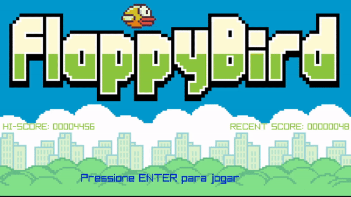

# Flappy Bird
Game desenvolvido como projeto final da cadeira de FUP(Fundamentos da programção), realizada durante o meu 1º semeste no ano de 2019. Foram utilizadas a linguagem de programação C e a biblioteca Raylib.
## Guia de instalação da Raylib

Instalar algumas bibliotecas necessárias:

1. ALSA para áudio
2. Mesa para gráficos acelerados OpenGL
3. X11 para sistema de janelas

Comandos para instalação das bibliotecas:
```
sudo apt install libasound2-dev mesa-common-dev libx11-dev libxrandr-dev libxi-dev xorg-dev libgl1-mesa-dev libglu1-mesa-dev
```

Faça o download do repositório raylib no Github e compile-o com:
```
git clone https://github.com/raysan5/raylib.git raylib
cd raylib/src/
make PLATFORM=PLATFORM_DESKTOP
```
Instale a biblioteca nos diretórios padrão usr/local/lib e /usr/local/include
```
sudo make install
sudo make install RAYLIB_LIBTYPE=SHARED
```

<sub>*Use o makefile da pasta</sub><br>
<sub>*O projeto foi realizado em 2019, então o processo de instalação da biblioteca pode ter sido alterado, dê prêferencia aos passos do site oficial: [Raylib](https://www.raylib.com/).</sub>

## Gameplay
